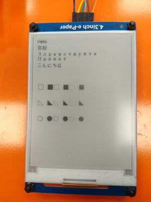
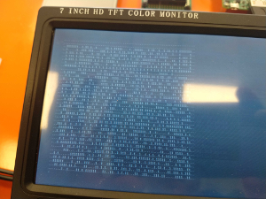
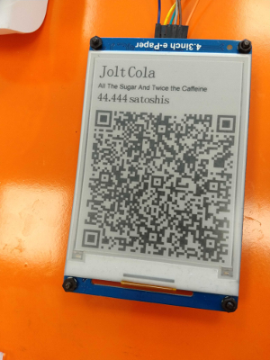

Overview
------
This library is an improvement and extension of [this repository](https://github.com/not-a-bird/waveshare-epaper-uart).  It is meant to work under Python3+ for the Raspberry Pi's GPIO output.

The API into this library is very similar to its predecessor and the provided examples there may be easily ported.

For more information about this display, see the [waveshare site](https://www.waveshare.com/4.3inch-e-paper.htm).  There is also a product [wiki page](https://www.waveshare.com/wiki/4.3inch_e-Paper_UART_Module).

It requires the GPIO library that is typically available on the Raspberry PI. The example programs require some packages for the QR code rendering and Twisted event loops.

The example programs are centered around displaying [Lightning Network](https://en.wikipedia.org/wiki/Lightning_Network) [BOLT11](https://github.com/lightningnetwork/lightning-rfc/blob/master/11-payment-encoding.md) invoices in QR Codes that can be picked up by a mobile wallet to perform a payment.

In The Wild
------

This was developed for a Lightning Network Jukebox demo project. You can see a demo of this here: 

Also, the source code for that project is in [this repository](https://github.com/jarret/lightning-station).

The Code
------

There is a bunch of stuff in the repo, but the featured general-purpose module is in [waveshare/epaper.py]. This module provides the Python 3 API for driving the display for an application.

Wiring
------
This diagram is for the Pi 3, and Pi 2. This will probably work on other Raspberry Pi iterations, but double-check that the pinout is the same to be sure. [This site](https://pinout.xyz/) has a clearer visual reference for finding the pins.

| PI3 Pin  | E-Ink Pin |
|---------:|:----------|
| 3.3 v  1 | 6 3.3v    |
| GND    6 | 5 GND     |
|GPIO15 10 | 4 DOUT    |
|GPIO14  8 | 3 DIN     |
|GPIO04  7 | 2 WAKE_UP |
|GPIO02  3 | 1 RESET   |

Configuring Pi Hardware
-------
You will need to edit `/boot/cmdline.txt` and delete the parameter `console=serial0,115200` from the line.

Also, you will need to enable the UART interface. Edit `/boot/config.txt` and add the line `enable_uart=1` and reboot.

If you are running with a Raspberry Pi 3, the UART port conflicts with the bluetooth connection and you will need to disable bluetooth for this to work. Edit `/boot/config.txt` and add `dtoverlay=pi3-disable-bt` and reboot.

Configuring Pi Software
-----------------
The `libpython-dev` and `RPIO` libraries are needed.

    sudo apt-get update
    sudo apt-get install libpython-dev python3-rpi.gpio

The `pyserial` package is also needed via `pip3`

    sudo apt-get install python3-pip
    pip3 install -U pyserial

For the QR Code examples, `qrcode` and `pillow` will need to be installed to render the image to be displayed.

    sudo apt-get install libopenjp2-7 libtiff5
    pip3 install -U pillow
    pip3 install -U qrcode

For the Twisted event loop examples, `twisted` will need to be installed.

    pip3 install -U twisted

Examples
--------

[test_basic.py](test_basic.py) This draws some basic text and shapes on the screen in different greyscale colors. Intended as a basic smoke test for the libary and doesn't depend on the QR Code and twisted libraries.

[test_qr.py](test_qr.py) This doesn't draw anything on the e-ink screen, it just tests that the QR code dependency is working properly. It outputs a rendered QR Code as ascii and the coordinate draw instructions on the terminal.

(you can pipe the standard of the script into `less` like so:  `./test_qr.py | less` to avoid scrolling by too fast)

[test_cycle.py](test_cycle.py) This cycles through several LN Invoice QR Code draws on the e-ink display. It measures the time of the various phases and outputs that on the console for comparison.

[test_gpio_input.py](test_gpio_input.py) This has nothing to do with the e-ink, but just does some basic GPIO push button input. For making sure that works beforecombining htat with the Twisted and e-ink parts.

[test_io.py](test_io.py) This also has nothing to do with the e-ink, but just does some basic GPIO push button input and LED output for making sure that works before combining that with the Twisted and e-ink parts.

[test_twisted_io.py](test_twisted_io.py) This is an example of using the e-ink display and the GPIO input and output from a Twisted event loop. The example program displayes the QR code corresponding to a push-button input.
